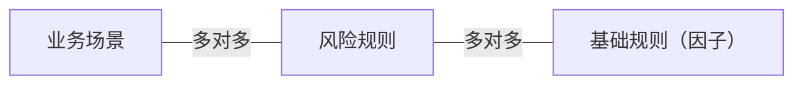
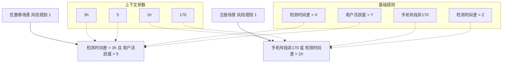
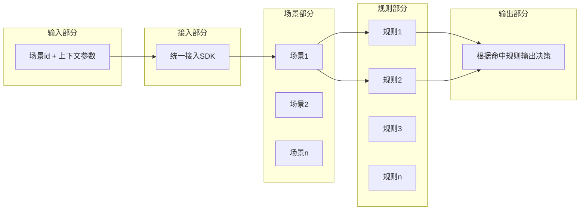
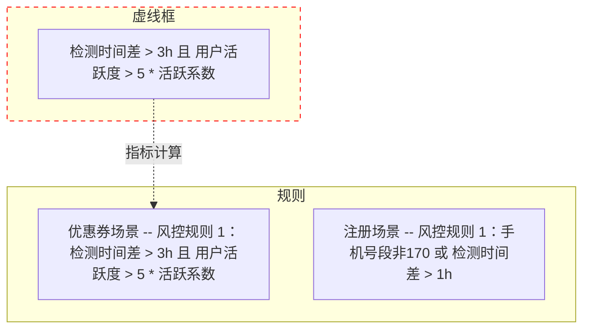
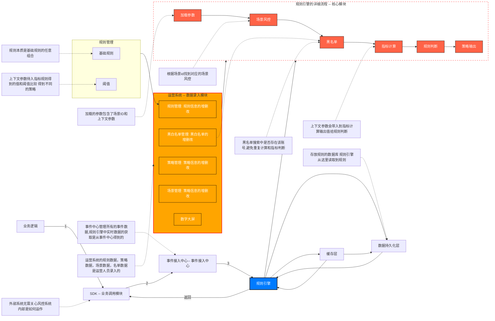
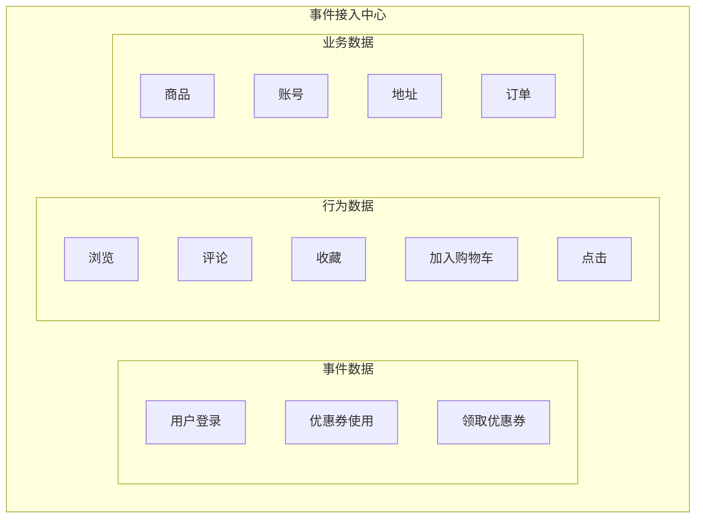
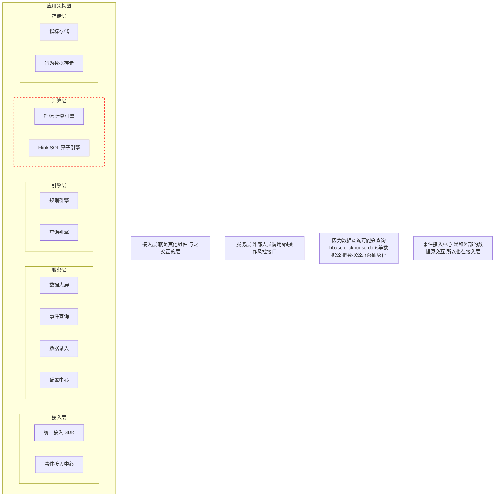

需求是否合理，是否能解决问题

能划分多少个子系统

每个子系统能划分多少个模块

这个系统需要可靠性吗，需要扩展能力吗？成本需要控制吗？

表如何设计？API如何设计？模块之间如何通信？

### 课程风控引擎设计的**核心点**

1. **高效率**的规则（策略）迭代 --> 风险规则可以**动态，自由组合**的调整
2. 充分的运营支撑 --> 监控大屏 + 完善的运营后台
3. 无缝的对接不同业务 --> 统一的接入SDK
4. 风控服务的稳定可靠 --> 服务高可用 + 熔断降级

### 风险规则设计思路

- 风险规则可以由**多个基础规则（因子）**组成
- 风险规则就是**与（AND）或（OR）非（NOT）**组合的逻辑运算
- 不同业务场景的风险规则也不同

也就是1小时和3小时

通过场景id 找到对应的场景

通过场景id 找到 这个场景所包含的规则

输入上下文参数 进行计算得到命中的规则

把命中的规则输出到

**为什么需要事件接入中心？**

- 将所有的事件数据进行**统一的管理**
- 从任意的数据源**以流式传输**大量的事件数据
- eg:登录场景有登录事件,修改密码事件 ,修改手机号事件,优惠券领取事件 ,使用事件

**事件接入中心：**

- 不同的业务场景，包含不同的**事件类型（eventType）**
- 事件接入中心是整个风控引擎的**数据流入口**

我们回顾一下上节课所画出的图。
对于一个封控系统,
最核心的部分是规则引擎。
规则引擎里面的主要流程是加载参数。
这里的参数包含了场景ID以及上下文参数,
然后通过场景ID找到对应的场景封控,
然后我们先搜索一下黑名单,
看账号是否在这个黑名单之中,
如果在的就不需要进行后面的操作。
如果不在的,我们把上下文参数带入到指标计算之后得到的值来进行规则的判断, 最后得到相应的策略输出。
这是最核心的模块,规则引擎。
第二个主要模块是数据录入模块, 也就是运营系统。
在这个运营系统主要做几样东西, 规则信息的录入,策略信息的录入, 场景信息的录入,黑名单信息的录入, 以及数据大屏。
然后规则录入这里包含两个部分, 因为一条风险规则是由多个基础规则联合, 逻辑运算与阈值组合而成。 第二部分是阈值的一个管理。
第三个主要的模块是接入模块, 也就是统一的接入SDK。
这部分这个模块主要是由业务逻辑来进行调用的。
第四个主要的模块是数据的入口, 也就是事件接入中心,
所有的事件都会先接入到事件接入中心里面进行统一管理
最后一个模块就是存储模块, 存储模块包含了缓程以及数据的持久化。

这张就是业务架构图,
因为我们这里的系统只有一个系统,
也就是封控系统,
我主要就把封控系统里面的模块,
把它划分出来。
第二个就是应用架构图,
把业务架构图画出来之后,
我就会根据这张业务架构图来画出应用架构图,
也就是把系统进行一个层次的划分,
以及画出各个系统,
里面需要有什么应用服务。
下面我就根据这张业务架构图来画出我们的应用架构图。
我们先看一下我们的封控系统,
它最外面的异常是统一的接入SDK,
它是跟外部的业务逻辑进行交互的,
所以我们首先要有一个接入层,
在接入层里面很自然的会有统一的接入SDK应用,
然后我们把事件接入中心也放入接入层,
因为事件接入中心它是数据的入口,
它是跟外部的不同的数据员进行打交道的,
它也是连接外部的一个组件,
所以我们就把事件接入中心也放入接入层,
接入层是和外部的组件进行打交道的一个层级,
我们还需要提供一些服务或者API的接口,
让外部的人员能够操作我们这个封控系统,
所以我们需要有一个服务层,
服务层里面我们主要把运营系统的这些功能某块把它放到服务层里面,
好像数据大屏、事件的查询、数据的录入以及配置中心,
我们都把它放到服务层里面。
下面就是最核心的某块规则引擎,
规则引擎有两个非常重要的流程,指标计算以及规则判断,
我们把这两个流程分别放到不同的层级里面。
所以我们这里设置两个层级,引擎务层以及计算务层,
引擎程主要做规则的判断以及查询的一些操作。
为什么要封装为查询引擎呢?
因为我们的数据查询有可能会查询redis,
也有可能会查询HBase,
也有可能会查询ClickHouse里面的数据,
那么我们把这些不同的查询把它封装为一个引擎,
把里面的不同的操作把它屏蔽掉。
计算程主要是做指标的计算以及FlinkSQL的一些算子计算。
最后一个模块就是存储模块,
主要是把它放入到存储程里面,
存储程里面的应用主要是指标的存储以及行为数据的存储,
以上就是一个应用架构图。

下面我们来看一下数据架构图。
业务系统有订单系统、支付系统、账户系统、活动系统,
我们这个项目主要是优惠串系统,业务系统会产生大量的离线数据,
这些离线数据有订单数据、优惠串数据、商品数据、账户数据以及用户的行为数据。
这些数据在后面的课程中我会提供给大家。
这些离线数据它存放在数仓里面,经过一系列的数据清洗以及数据聚合之后,有一个数仓主题是进行离线的指标计算。
这个离线指标计算有什么用呢?
大家先放在这里,先记着。
业务系统除了产生离线数据之外,还会产生一系列的事件数据。事件数据主要是流入事件接入中心。
事件接入中心有两个功能,一个是异部处理功能,一个是订阅服务。
封控系统就是订阅事件接入中心里面的事件数据。
以数据流的形式流入封控系统,然后数据先通过黑白名单的搜索,看账号是否在黑白名单之中。
这里的黑白名单,一方面它是由运营人员进行录入,另一方面就是通过离线指标计算,将一些非常可疑行为的账号把它写入到黑名单之中。
如果账户不在黑白名单之中,它会进入下一步就是进行指标计算以及规则判断。

最后我们来看一下技术架构图。

我们在弄清楚了整个业务流程之后,把主要的业务模块把它划分出来,然后以分成的形式把系统划分为各个层次,以及确认每个层次包含哪些应用模块。
然后再确认确定数据在整个系统中是如何流转之后,最后我们就要确定需要用哪些技术来实现我们的系统。
在数据接入方面,主要的是事件接入中心。
前面同学们应该也想到了,
事件接入中心的主要模块是kafka。
没错,在数据接入方面,主要用的是flume+kafka。
flume主要是从各个不同的数据源里面读取数据,以数据流的形式流入kafka。
这些数据除了事件数据之外,还有用户的行为数据,
这些存放在kafka里面的用户行为数据,最终它会流向哪里呢?是流向HUB度吗?还是流向Hive?
不是的,在我们这个项目里面采用一个新的组件,
ClickHouse。ClickHouse去监听kafka里面的数据,
读取里kafka里面的用户行为数据,将用户行为数据存放在ClickHouse里面。
为什么要这样子做呢?
大家先记着,在后面的课程我会详细的讲解原因。
接下来是核心部分,实时封控,以及离线封控。
在离线封控,主要是用Flink+ClickHouse这两个组件进行。
Flink主要是用作指标的计算,而指标的计算值它的存储,一方面它是存储在redis里面,另一方面是存储在HBase。
redis主要是用作指标的一个缓存的存储,HBase是指标的一个持久化存储。
在实时封控方面,主要是用Flink CEP+groovy加Aviator。
groovy是规则引擎,Aviator它是表达是引擎。
所以在我们上面的这张图的引擎程里面,还需要添加一个引擎,就是表达是引擎。
表达式引擎它的实现的组件是Aviator。
最后是我们规则信息以及黑名单信息的这些配置信息,它是存储在MySQL里面。

控系统它的核心是规则引擎
规则引擎就是由一条一条的风险规则组成
然后对这些风险规则进行一个过滤判断
同学们在平时的编码中其实有意或者无意的都会写过风险规则，只是这些风险规则它是写在代码里面是属于硬编码的形式
而且用的语法应该大部分都是用if else
有些可能基础比较好的同学会使用设计模式来代替if else
但是这些对于一些数量比较少
或者说不会经常变化的风险规则,这些方法还可以
但是对于风险规则的数量很多而且比较的复杂,还有就是它要实时的进行变化的话
用if else或者说设计模式其实是使得代码很庸重而且难维护
这节课我向同学们推荐一个规则引擎的框架groovy
我想应该很多同学都没有接触过这个框架
这节课我先简单的介绍一下groovy这个规则引擎框架
在后面的课程中会有专门的章节专门去针对groovy这个框架来进行讲解的
经过我前几节课的反复强调，我想同学们应该对规则引擎不会很陌生了
规则引擎本质上就是风险规则的集合
每条的风险规则它是由多个的基础规则联合
逻辑运算与，或，非来自由任意的组合而成的
那么同学们有没有想过，为什么我要将规则引擎单独取出来，把它作为风控系统的一个独立模块呢，为什么不将规则的判断写到代码里面呢
我们先看一个例子

这里有三条规则
这三条规则之间是通过逻辑运算符连接而成的
我们知道逻辑运算它的执行顺序是从左往右
也就是说规则1和规则2在同时成立的情况下，再和规则3进行逻辑运算
我们用if else 语句是写成这样子的形式

那么现在我想再添加多几条规则规则4和规则5，那是不是我要添加上一个if 语句
如果我想再添加多几条规则，那是不是我要写上好几个if 语句
这样子的代码是不是变得很臃肿很难维护
这是第1种情况
第二种情况是这样子的规则的逻辑运算，代码的可读性是不是很差而且也很难维护
第三种情况是 ，系统在运行之中 我想根据当时的情况来实时的去添加几条规则 或者说修改规则里面的内容 那我是不是又要重新写代码
重新打包 然后重新放到线上去运行
我能不能实时的去修改这些规则呢？
所以风险规则它实际上是一个数量庞大 而且复杂 且可以不断变化的一个规则组合
如果用if else 语句其实是很难维护这些风险规则的
我们需要有单独的一个模块 独立的去操控这些风险规则 让它和我们的业务逻辑割裂开
我们用一个图表来表示一下

在没有引入规则引擎之前 风险规则它是写到业务逻辑里面的 这样子使得业务逻辑的代码很庸重 而且很难维护 阅读性也很差
现在我们要将风险规则从业务逻辑里面隔离开 专门由规则引擎去维护这些风险规则

业务逻辑在需要风险判断的时候 再请求规则引擎 这样子就使得业务逻辑和风险规则的一个解耦
下面总结一下为什么需要规则引擎？
风险规则它的一个特点是变动频率高 组合复杂而且数量多
如果我们用if else与句来去写风险规则的判断的话 只会使得if else与句越来越庞道难以维护
而且风险规则它是以代码的形式写到业务逻辑里面 我们即使做一些很小的变动 也要重新编码重新打包 重新放到线上去执行
如果我们引入了规则引擎 那么风险规则不再是if else的流程分支 它是交给规则引擎去执行 而且风险规则不再是以代码的形式存在
它是以规则文件的形式存在
这样子可以进行一个预加载 把它放到内存里面进行读取和执行
还有就是风险规则的变更 可以直接去修改规则文件 实现动态加载 无需再进行重新的编码和打包
还有最重要最重要的一点是 风险规则的变更 修改可以交给运营人员直接去修改 无需程序员去进行一个编码的操作
在明白了为什么需要规则引擎之后
我们来看一下市面上主流的规则引擎框架
现在市面上
无论是开源还是收费的规则引擎框架
其实有很多
但是开源的高性能的
使用的又比较广泛的规则引擎框架
只有两款
groovy以及drools
drools是一个企业级的规则引擎框架 它是擅长适配复杂的对象
这里大家要注意 它匹配的是复杂对象
这个复杂对象包含的属性有可能是上百 或者上千
drools它并不是简单重复的去匹配规则
现在很多大厂的封控系统的规则引擎框架使用的就是drools
groovy它算是一个轻量级的规则引擎框架
它是一个动态语言
它是采用反射的方式来动态的执行表达式的值
groovy和java一样都是依赖JIT的编译器
在执行的次数够多的情况下 它可以编译为本地字节码 所以groovy的性能还是很高的
groovy更适应于反复执行的表达式
groovy它能够动态的修改线上的代码
无需重新打包
那么为什么我们的项目会使用groovy作为规则引擎框架呢
因为groovy和java是无缝兼容的
groovy是能够兼容java几乎所有的语法
groovy能够调用java几乎所有的库
groovy的框架能够利用java现有的框架
例如Spring
开发者开发groovy就好像开发java一样简单
甚至不需要使用groovy它特定的语法
只要在java项目中引入groovy并且利用groovy的动态功能
有人说groovy就好像是运行在java平台上的
但又媲美python ruby这些灵活动态语言
groovy能做的事情很多
但是它又没有java语法的那么永长
相比较于groovy的学习门槛是很低的
所以在项目中我就用groovy作为规则引擎的框架
