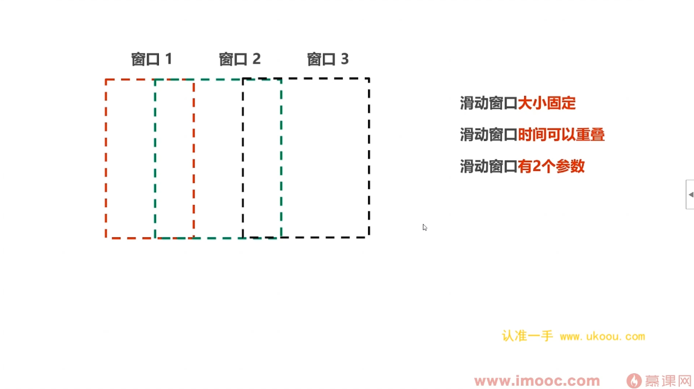

需求是否合理，是否能解决问题

能划分多少个子系统

每个子系统能划分多少个模块

这个系统需要可靠性吗，需要扩展能力吗？成本需要控制吗？

表如何设计？API如何设计？模块之间如何通信？

### 课程风控引擎设计的**核心点**

1. **高效率**的规则（策略）迭代 --> 风险规则可以**动态，自由组合**的调整
2. 充分的运营支撑 --> 监控大屏 + 完善的运营后台
3. 无缝的对接不同业务 --> 统一的接入SDK
4. 风控服务的稳定可靠 --> 服务高可用 + 熔断降级

### 风险规则设计思路

- 风险规则可以由**多个基础规则（因子）**组成
- 风险规则就是**与（AND）或（OR）非（NOT）**组合的逻辑运算
- 不同业务场景的风险规则也不同

也就是1小时和3小时

通过场景id 找到对应的场景

通过场景id 找到 这个场景所包含的规则

输入上下文参数 进行计算得到命中的规则

把命中的规则输出到

**为什么需要事件接入中心？**

- 将所有的事件数据进行**统一的管理**
- 从任意的数据源**以流式传输**大量的事件数据
- eg:登录场景有登录事件,修改密码事件 ,修改手机号事件,优惠券领取事件 ,使用事件

**事件接入中心：**

- 不同的业务场景，包含不同的**事件类型（eventType）**
- 事件接入中心是整个风控引擎的**数据流入口**

我们回顾一下上节课所画出的图。
对于一个封控系统,
最核心的部分是规则引擎。
规则引擎里面的主要流程是加载参数。
这里的参数包含了场景ID以及上下文参数,
然后通过场景ID找到对应的场景封控,
然后我们先搜索一下黑名单,
看账号是否在这个黑名单之中,
如果在的就不需要进行后面的操作。
如果不在的,我们把上下文参数带入到指标计算之后得到的值来进行规则的判断, 最后得到相应的策略输出。
这是最核心的模块,规则引擎。
第二个主要模块是数据录入模块, 也就是运营系统。
在这个运营系统主要做几样东西, 规则信息的录入,策略信息的录入, 场景信息的录入,黑名单信息的录入, 以及数据大屏。
然后规则录入这里包含两个部分, 因为一条风险规则是由多个基础规则联合, 逻辑运算与阈值组合而成。 第二部分是阈值的一个管理。
第三个主要的模块是接入模块, 也就是统一的接入SDK。
这部分这个模块主要是由业务逻辑来进行调用的。
第四个主要的模块是数据的入口, 也就是事件接入中心,
所有的事件都会先接入到事件接入中心里面进行统一管理
最后一个模块就是存储模块, 存储模块包含了缓程以及数据的持久化。

这张就是业务架构图,
因为我们这里的系统只有一个系统,
也就是封控系统,
我主要就把封控系统里面的模块,
把它划分出来。
第二个就是应用架构图,
把业务架构图画出来之后,
我就会根据这张业务架构图来画出应用架构图,
也就是把系统进行一个层次的划分,
以及画出各个系统,
里面需要有什么应用服务。
下面我就根据这张业务架构图来画出我们的应用架构图。
我们先看一下我们的封控系统,
它最外面的异常是统一的接入SDK,
它是跟外部的业务逻辑进行交互的,
所以我们首先要有一个接入层,
在接入层里面很自然的会有统一的接入SDK应用,
然后我们把事件接入中心也放入接入层,
因为事件接入中心它是数据的入口,
它是跟外部的不同的数据员进行打交道的,
它也是连接外部的一个组件,
所以我们就把事件接入中心也放入接入层,
接入层是和外部的组件进行打交道的一个层级,
我们还需要提供一些服务或者API的接口,
让外部的人员能够操作我们这个封控系统,
所以我们需要有一个服务层,
服务层里面我们主要把运营系统的这些功能某块把它放到服务层里面,
好像数据大屏、事件的查询、数据的录入以及配置中心,
我们都把它放到服务层里面。
下面就是最核心的某块规则引擎,
规则引擎有两个非常重要的流程,指标计算以及规则判断,
我们把这两个流程分别放到不同的层级里面。
所以我们这里设置两个层级,引擎务层以及计算务层,
引擎程主要做规则的判断以及查询的一些操作。
为什么要封装为查询引擎呢?
因为我们的数据查询有可能会查询redis,
也有可能会查询HBase,
也有可能会查询ClickHouse里面的数据,
那么我们把这些不同的查询把它封装为一个引擎,
把里面的不同的操作把它屏蔽掉。
计算程主要是做指标的计算以及FlinkSQL的一些算子计算。
最后一个模块就是存储模块,
主要是把它放入到存储程里面,
存储程里面的应用主要是指标的存储以及行为数据的存储,
以上就是一个应用架构图。

下面我们来看一下数据架构图。
业务系统有订单系统、支付系统、账户系统、活动系统,
我们这个项目主要是优惠串系统,业务系统会产生大量的离线数据,
这些离线数据有订单数据、优惠串数据、商品数据、账户数据以及用户的行为数据。
这些数据在后面的课程中我会提供给大家。
这些离线数据它存放在数仓里面,经过一系列的数据清洗以及数据聚合之后,有一个数仓主题是进行离线的指标计算。
这个离线指标计算有什么用呢?
大家先放在这里,先记着。
业务系统除了产生离线数据之外,还会产生一系列的事件数据。事件数据主要是流入事件接入中心。
事件接入中心有两个功能,一个是异部处理功能,一个是订阅服务。
封控系统就是订阅事件接入中心里面的事件数据。
以数据流的形式流入封控系统,然后数据先通过黑白名单的搜索,看账号是否在黑白名单之中。
这里的黑白名单,一方面它是由运营人员进行录入,另一方面就是通过离线指标计算,将一些非常可疑行为的账号把它写入到黑名单之中。
如果账户不在黑白名单之中,它会进入下一步就是进行指标计算以及规则判断。

最后我们来看一下技术架构图。

我们在弄清楚了整个业务流程之后,把主要的业务模块把它划分出来,然后以分成的形式把系统划分为各个层次,以及确认每个层次包含哪些应用模块。
然后再确认确定数据在整个系统中是如何流转之后,最后我们就要确定需要用哪些技术来实现我们的系统。
在数据接入方面,主要的是事件接入中心。
前面同学们应该也想到了,
事件接入中心的主要模块是kafka。
没错,在数据接入方面,主要用的是flume+kafka。
flume主要是从各个不同的数据源里面读取数据,以数据流的形式流入kafka。
这些数据除了事件数据之外,还有用户的行为数据,
这些存放在kafka里面的用户行为数据,最终它会流向哪里呢?是流向HUB度吗?还是流向Hive?
不是的,在我们这个项目里面采用一个新的组件,
ClickHouse。ClickHouse去监听kafka里面的数据,
读取里kafka里面的用户行为数据,将用户行为数据存放在ClickHouse里面。
为什么要这样子做呢?
大家先记着,在后面的课程我会详细的讲解原因。
接下来是核心部分,实时封控,以及离线封控。
在离线封控,主要是用Flink+ClickHouse这两个组件进行。
Flink主要是用作指标的计算,而指标的计算值它的存储,一方面它是存储在redis里面,另一方面是存储在HBase。
redis主要是用作指标的一个缓存的存储,HBase是指标的一个持久化存储。
在实时封控方面,主要是用Flink CEP+groovy加Aviator。
groovy是规则引擎,Aviator它是表达是引擎。
所以在我们上面的这张图的引擎程里面,还需要添加一个引擎,就是表达是引擎。
表达式引擎它的实现的组件是Aviator。
最后是我们规则信息以及黑名单信息的这些配置信息,它是存储在MySQL里面。

控系统它的核心是规则引擎
规则引擎就是由一条一条的风险规则组成
然后对这些风险规则进行一个过滤判断
同学们在平时的编码中其实有意或者无意的都会写过风险规则，只是这些风险规则它是写在代码里面是属于硬编码的形式
而且用的语法应该大部分都是用if else
有些可能基础比较好的同学会使用设计模式来代替if else
但是这些对于一些数量比较少
或者说不会经常变化的风险规则,这些方法还可以
但是对于风险规则的数量很多而且比较的复杂,还有就是它要实时的进行变化的话
用if else或者说设计模式其实是使得代码很庸重而且难维护
这节课我向同学们推荐一个规则引擎的框架groovy
我想应该很多同学都没有接触过这个框架
这节课我先简单的介绍一下groovy这个规则引擎框架
在后面的课程中会有专门的章节专门去针对groovy这个框架来进行讲解的
经过我前几节课的反复强调，我想同学们应该对规则引擎不会很陌生了
规则引擎本质上就是风险规则的集合
每条的风险规则它是由多个的基础规则联合
逻辑运算与，或，非来自由任意的组合而成的
那么同学们有没有想过，为什么我要将规则引擎单独取出来，把它作为风控系统的一个独立模块呢，为什么不将规则的判断写到代码里面呢
我们先看一个例子

这里有三条规则
这三条规则之间是通过逻辑运算符连接而成的
我们知道逻辑运算它的执行顺序是从左往右
也就是说规则1和规则2在同时成立的情况下，再和规则3进行逻辑运算
我们用if else 语句是写成这样子的形式

那么现在我想再添加多几条规则规则4和规则5，那是不是我要添加上一个if 语句
如果我想再添加多几条规则，那是不是我要写上好几个if 语句
这样子的代码是不是变得很臃肿很难维护
这是第1种情况
第二种情况是这样子的规则的逻辑运算，代码的可读性是不是很差而且也很难维护
第三种情况是 ，系统在运行之中 我想根据当时的情况来实时的去添加几条规则 或者说修改规则里面的内容 那我是不是又要重新写代码
重新打包 然后重新放到线上去运行
我能不能实时的去修改这些规则呢？
所以风险规则它实际上是一个数量庞大 而且复杂 且可以不断变化的一个规则组合
如果用if else 语句其实是很难维护这些风险规则的
我们需要有单独的一个模块 独立的去操控这些风险规则 让它和我们的业务逻辑割裂开
我们用一个图表来表示一下

在没有引入规则引擎之前 风险规则它是写到业务逻辑里面的 这样子使得业务逻辑的代码很庸重 而且很难维护 阅读性也很差
现在我们要将风险规则从业务逻辑里面隔离开 专门由规则引擎去维护这些风险规则

业务逻辑在需要风险判断的时候 再请求规则引擎 这样子就使得业务逻辑和风险规则的一个解耦
下面总结一下为什么需要规则引擎？
风险规则它的一个特点是变动频率高 组合复杂而且数量多
如果我们用if else与句来去写风险规则的判断的话 只会使得if else与句越来越庞道难以维护
而且风险规则它是以代码的形式写到业务逻辑里面 我们即使做一些很小的变动 也要重新编码重新打包 重新放到线上去执行
如果我们引入了规则引擎 那么风险规则不再是if else的流程分支 它是交给规则引擎去执行 而且风险规则不再是以代码的形式存在
它是以规则文件的形式存在
这样子可以进行一个预加载 把它放到内存里面进行读取和执行
还有就是风险规则的变更 可以直接去修改规则文件 实现动态加载 无需再进行重新的编码和打包
还有最重要最重要的一点是 风险规则的变更 修改可以交给运营人员直接去修改 无需程序员去进行一个编码的操作
在明白了为什么需要规则引擎之后
我们来看一下市面上主流的规则引擎框架
现在市面上
无论是开源还是收费的规则引擎框架
其实有很多
但是开源的高性能的
使用的又比较广泛的规则引擎框架
只有两款
groovy以及drools
drools是一个企业级的规则引擎框架 它是擅长适配复杂的对象
这里大家要注意 它匹配的是复杂对象
这个复杂对象包含的属性有可能是上百 或者上千
drools它并不是简单重复的去匹配规则
现在很多大厂的封控系统的规则引擎框架使用的就是drools
groovy它算是一个轻量级的规则引擎框架
它是一个动态语言
它是采用反射的方式来动态的执行表达式的值
groovy和java一样都是依赖JIT的编译器
在执行的次数够多的情况下 它可以编译为本地字节码 所以groovy的性能还是很高的
groovy更适应于反复执行的表达式
groovy它能够动态的修改线上的代码
无需重新打包
那么为什么我们的项目会使用groovy作为规则引擎框架呢
因为groovy和java是无缝兼容的
groovy是能够兼容java几乎所有的语法
groovy能够调用java几乎所有的库
groovy的框架能够利用java现有的框架
例如Spring
开发者开发groovy就好像开发java一样简单
甚至不需要使用groovy它特定的语法
只要在java项目中引入groovy并且利用groovy的动态功能
有人说groovy就好像是运行在java平台上的
但又媲美python ruby这些灵活动态语言
groovy能做的事情很多
但是它又没有java语法的那么永长
相比较于groovy的学习门槛是很低的
所以在项目中我就用groovy作为规则引擎的框架

第4章
1.2
现在流似数据处理的主流技术是数据流模型。数据流模型是什么?
同学们不用管。同学们只是要知道通过数据流模型提供的接口,我们就能够很方便的对流似数据进行处理和计算。
这个数据流模型它有两个场面。第一个场面是编程模型。编程模型提供的接口是面向应用的，它是对流似数据的业务逻辑进行计算。
第二个场面是执行模型。执行模型提供的接口是面向底层的。它主要描述的是流似数据的一个计算过程。
那么这节课我们所讲解的API主要就是编程模型提供的API。
到这里同学们应该清楚了吧。这节课讲解两个部分。
第一部分是Flink它提供了哪些API。Flink它是提供了好几个类别的API跟我们调用来对流似数据进行处理。
第二部分是讲解Flink在处理流似数据它的一个最基础的代码套路。
什么意思呢?举个例子。我们在对MySQL数据进行查询的时候,它的一个套路是怎么样呢?
首先是要先连接上MySQL,然后进入到对应的数据库,找到对应的表才进行数据的查询,
然后将查询结果返回,最后是断开跟MySQL的一个连接。
这个就是一个套路,不是说我一上来就能够对MySQL数据进行查询。
Flink提供了不同抽象层次的API。我们换一种说法,大家应该好理解一些。
也就是Flink它提供了封装程度不同的API。
现在使用最主流、最广泛的API,我们叫做Core API。
Core API它包含了DataStream API以及DataSet API。
大家要注意的是,Flink从1.14这个版本之后,是不建议再使用DataSet API。
这也是我为什么耍用Flink 1.14这个版本。
因为这个版本之后,Flink它只用一套的API,就能够处理流氏数据,也能够进行批处理。
因为在之前进行流氏数据的处理,它需要一套的API,
而进行批处理,它需要再写另外的一套API。
DataSet API它的核心内在Flink Java这个模块里面。
DataStream API它的核心内是在Flink Streaming Java这个包里面。
我们看一下代码,DataSet它的核心内是在Flink Java这个包里面。
但是1.14版本之后DataSet API是不建议使用了,
所以关于这个包大家可以不需要关心。
DataStream API它的核心内是在Flink Streaming Java这个包里面。
项目的很多代码的API函数都是调用这个包的。
其实DataStream API和DataSet API都分别提供了很丰富的函数,
而且这两种API所提供的函数都是非常类似的。
例如这两种API它们都提供了转换函数map,
也提供了过滤函数filter以及连接函数join。
那么同学们有没有想过Flink为什么要弃用DataSet API呢?
在这里我先卖一个关子,同学们先思考一下。
Flink除了提供core API之外还提供两种关系型的API,
table API以及sql。
通常的我们将table API和sql是合并一起来说的,
因为table API和sql它不能都有80%的代码是可以共用的。
通过下面这张图我们可以了解到table API和sql它们的一些不同之处。

例如对于查询table API它是提供了一个select函数,
而sql它就直接写一句sql语句就可以了。
所以table API它是一种late sql的函数,
而sql它是flame API之中封装程度最高,
抽象等级最高的API。
sql它有非常严格的语法和规范,
我们不需要关心它底层的实现,
只需要写上几句sql语句就可以对数据进行处理。
上手非常的简单,
这也是为什么很多人招销我们大数据开发的工程师为sql board的原因。
我们来看一下下面这张图。
Flink它提供了data stream API以及data set API。
这两种API是属于core API。
core API它是封装了一系列的针对流逝数据处理的函数。
其实core API它的底层还有一层的。
这一层我们称为stable stream processing。
它是封装了一系列的过程函数来嵌入到data stream API
或者data set API进行调用的。
table API它是对core API进行了进一步的封装和优化。
sql相对于table API它的封装程度更好,抽象层级更高。
它只需要编写sql语句就可以对流逝数据进行处理。
Flink在1.9版本之前它只有两种API,
以及data set API。
在1.9版本之后是逐步的弃用data set API,
到1.14版本就完全不建议使用data set API。
也就是说Flink在1.9版本之后所建议使用的API只有三种。
data stream API、table API以及sql大家可以根据实际的情况
来选择相应的API进行开发。
现在回到我们前面提到的问题,
为什么Flink要弃用data set API?
是因为Flink它的使命是成为流批统一的计算引擎。
重要的事情说三遍,Flink是流批统一的计算引擎,
Flink是流批统一的计算引擎,Flink是流批统一的计算引擎,
spark不是流批统一的计算引擎,
这也是Flink和spark最大的不同之处,
也是Flink能够取代spark的关键所在。
Flink之所以要弃用data set API,
是因为data set API它只适用于批处理,
而不能够针对流似数据进行处理。
data stream API它既能够对流似数据进行处理,
也能够进行批处理。
同样的tables API以及sql也是既能够对流似数据进行处理,
也能够进行批处理。
所以这三种API被保留了下来,而data set API被弃用。
下面我们来看一下Flink在程序上处理流似数据的最基本的步骤。
Flink程序上处理流似数据主要有两部分,
第一部分是流,也就是streams。
第二部分是转换,也就是transformations。
流这部分主要有两个流。
第一个流是输入流，输入流提供了一个远远不断的不会结束的数据流。第二部分是sink,也就是输出流。
transformations这部分则是利用flame提供的各种的API函数,对输入流的数据进行转换和处理来生成我们所需要的结果。
Flink程序在处理流似数据它的代码步骤一共有四步。
第一步是加载上下文信息,有同学可能会比较好奇,
为什么要先加载上下文信息呢?
因为Flink程序可以在本地运行也可以放到集群上面运行,本地环境和集群环境是两个不同的运行环境。
程序也只有获取到对应环境的上下文信息,才能够取得和Flink框架的联系。程序也只有在获取到对应环境的上下文信息,
才能够将任务分配到不同的task manager上面去运行。
第二步就是加载数据,就是source这部分,就是从输入流导入数据。
第三步是处理数据,也就是transformation这部分。
transformations这部分主要就是利用data stream API或者table API或者SQL所提供的函数, 来对输入流的数据进行处理和转换。
第四步就是输出结果,就是sink这部分,就是生产输出流。
首先看一下加载环境的代码。
加载环境它最简单的方式就是调用Executionenvironment.getExecutionenvironment()这个静态方法。
大家现在看到的是data set API的版本,这个版本已经被淘汰的,大家只需要了解一下就可以了。
在data set API这个版本里面,get execution environment这个静态方法是属于 executionEnvironment这个对象的,
生成的是 executionEnvironment类型的实例,这个实例它只能够进行批处理,而不能够对流寿数据进行处理的。
现在主要是使用data stream API版本来进行上下文家载的。
主要使用的是streamExecutionEnvironment这个对象的静态方法。
getExecutionEnvironment来进行上下文加载,生成的是stream execution environment类型的实例。
这个实例是能够支持流处理,也能够支持批处理的。
这也贯彻了flink流批一体的思想。
下面来看一下flink的输入流。
flink是类制了好几种source来跟我们调用。
第一个是能够读取文件里面的内容来作为输入流。
第二个是能够将一系列的元素来作为输入流。
但是无论是读取文件还是将一系列的元素作为输入流, 它读取的都是有限的数据集。
如果这个source它是一个源源不断的数据流,
我们则可以采用socket或者kafka。
如果采用kafka作为数据源的话,
则需要引入对应版本的kafka connector。
这个在我们后面的课程会也是。
我们这个封控系统的项目主要采用的是kafka作为数据源。
在下节课我们就通过flink来进行持平的一个计算,
就相当于flink的一个Hello World程序。
这里我们先回顾一下持平计算它的逻辑是怎么样的。
首先是要对美行数据按照空格将每一行的单词把它切割开来,然后组成集合。
第二步就是对集合里面的单词把它标记为1。
第三步就是按照单词来进行分组。
最后就是将分组后的单词来进行一个求合计算。
这样子就可以得到每个单词它的词频数量。

FLINK的四大基石。四大基石分别是FLINK的状态机制,窗口机制,时间机制,以及容错机制。
那么我会分别用不同的课程来对这四大基石进行讲解。
这节课我们首先是讲解一下FLINK的状态机制。
这里有几道面试题是FLINK必问的。
FLINK状态类型包括哪些?
FLINK的状态是如何存储的?
说一下FLINK的广播状态模式。
状态过期之后会如何处理?
看到这些面试题,同学们如果在牢海里没有一点的思路,或者说不知道我在说什么,
那么这节课同学们就要认真地听讲一下。
这节课我会讲四个部分。
第一部分是讲解一下FLINK的状态类型有哪些?
第二部分是讲解一下FLINK的其中一个状态,叫做key state。这个状态需要同学们重点掌握一下。
第三个是说一下FLINK的广播状态,
最后是说一下FLINK状态是如何进行存储的。
在开始讲解之前,
我们先弄清楚一个概念——算子。
在前几节课中,我多次提到这个算子概念。
有些同学应该会感到疑惑,
算子是什么?算子是和函数是同样东西吗?
其实算子是FLINK任务中用于处理数据的一个单元。
处理数据包括哪些?包括了读取数据、保存数据、转换数据、计算数据等等。
MAP是一个算子,MAP就是处理数据的单元。
keyBy也是一个算子,keyBy也是处理数据的单元。
先看一下状态这个概念,状态被称为state。
在FLINK里面,状态是用来保存中间的计算结果。
什么是中间的计算结果?
我们还是以Spark作为类比。
在Spark里面,同一个算子里面,下游的计算阶段,它要依赖于上游计算阶段所计算出来的中间结果。
那么在FLINK的流式计算里面,因为事件流是源源不断的,
对一个事件的计算,如果它无需依赖于前后的事件,这个事件的计算它是独立的,那么就被称为FLINK的无状态计算,
反之如果这个事件的计算它要依赖于前后事件,那么就被称为FLINK的有状态计算。
举一个例子,求和sum这个算子它就是有状态计算,因为它需要将多个事件的数据进行累加。
了解了状态这个概念之后,
我们来看一下FLINK为我们提供了拿几种类型的状态。
首先FLINK是提供了原始状态和托管状态两种类型。
这两种类型的状态有什么区别呢?
首先从管理的角度来看,原始状态是由用户进行管理的,托管状态是由FLINK进行管理的。
托管状态是能够自动的进行存储以及自动的进行恢复。
而且由于托管状态它是由FLINK进行管理,
所以托管状态它的类传管理是经过FLINK的一系列的优化。
而原始状态则需要用户自行的进行存储以及自行的进行序列化。
为什么要自行的进行序列化呢?
因为处于原始状态,FLINK是不知道用户存到这个状态里面的数据结构是什么,
只有用户自己知道,所以需要用户自行的将它序列化为一个可存储的数据结构。
第二个,从数据结构的角度来看,托管状态它是支持已知的数据结构,例如Value,例如Map,例如list,
而原始状态它只支持字节数据。
第三个,从使用的场景来看,托管状态它是适用于大部分的场景,而且在生产环境下,我们是建议使用托管状态,
只有在托管状态不够用的情况下,或者说用户自定义算子,我们才使用原始状态。
我们用一个图来表示一下,

首先Flink是提供了两种类型的状态,
原始状态以及托管状态,
而在托管状态这种类型,区分为两种类型的状态,keyState以及operatorState。
在讲解keyState以及operatorState这两种状态类型之前,

keyBy跟groupBy他们的本质思想其实是一样的,
就是将相同key的元素把它放到同一个集合里面,
然后分别对这些集合里面的相同key的元素进行操作。
在spot里面,类似的是有groupBy这种算子。
spot的groupBy算子它是将相同的key的元素放到一个集合里面,
也就是说多个输入元素它对应的是一个输出元素,
也就是不同的key它的对应的是一个集合。
而在Flink的keyBy算子里面,
它是将相同key的元素把它散列到同一个子任务里面, 而且它不会改变这些元素的数据结构, 也就是说Flink的keyBy算子它是一个输出元素对应一个输入元素。

这种存放相同key的元素的子任务的数据流, 我们称为keyStream,不同的key的元素它们分别对应自己的状态, 但是相同key的元素则可以共享同一个状态。
所以keyStream这种状态类型它是指keyStream上面的状态,
在keyStream里面,如果key相同的元素是可以共享同一个状态, 不同的key的元素则是对应不同的状态。
要注意的是keyState它是针对于同一个的算子实例,
而operatorState它是应用于所有的算子, 也就是每个算子实例可以共享同一个状态。
到这里我们来总结一下Flink的状态类型。
Flink是提供了两种的状态类型, 原始状态以及托管状态。
托管状态又可以细分为keyState以及operatorState。
keyState它是针对于同一个的算子实例,
而operatorState它是针对于所有的算子实例, 对于operatorState来说所有的算子实例都可以共享一个状态。
而keyState则是指在同一个算子实例里面, 在keyState上,如果相同key的元素, 它可以共享同一个状态, 而不同key的元素则是对应不同的状态。

我们来看一下keyState它的使用,
因为keyState它是在keyStream上面的状态,
而keyState是经过keyBy算子后生产的, 所以keyState状态的读取以及更新, 是必须要先进行keyBy算子。
我们来看一下new countAverage这个类,
是对keyState进行读取和更新的类, 这个类的使用必须要放在key by算子之后, 不然就会进行爆错。
第二个keyState状态进行读取以及更新操作的这些类,
必须要继承richXXXXFunction,
例如richFriendMapFunction这些函数。
为什么要继承richXXXXFunction呢? 因为richXXXXFunction类函数它包含了运行时上下文, 而运行时上下文就包含了状态的数据。
我们来看一下,
刚才我们已经说了new countAverage这个类,
就是对keyState进行读取和更新的类,
那么这个类在哪里?在这里。
这个类它必须要继承richXXXXFunction,
例如richFriendMapFunction这个函数,
才能够对keyState状态进行读取和更新。
第三个,就是在继承richXXXXFunction函数之后,
要实现其中的open方法, 在open方法中要初始化keyState, 只有初始化了keyState才能够对keyState的状态进行读取和更新。
我们来看一下代码,
在记成了rich类函数之后,
我们要实现其中的open方法,
在open方法里面是对keyState状态进行一个初始化(☆☆☆☆☆☆☆☆☆),
它是通过运行时上下文的getState这个方法, 来获取到keyState状态。
对于keyState,
Flink是提供了几种的数据结构功我们使用, 例如valueState, 又例如listState,
而相应的数据结构的获取, 要通过相应的StateDescriptor来进行的。
例如valueState这个数据结构的获取, 是通过valueStateDescriptor这个对象来获取的,
而listState这个数据结构, 则需要通过listStateDescriptor这个对象来获取的,
然后将生成的数据结构的类型, 把它传入到getState这个方法里面,
就能够将keyState里面的状态, 把它存放到对应的数据结构里面。
keyState在进行初始化之后,
下面就可以进行对keyState状态的读取,
更新等的具体的业务操作。

下面我们来看一下广播状态, 广播状态是Flink提供的另外一种的状态类型,
它是在Flink1.5版本之后出现的状态类型,
广播状态对于需要动态更新的应用来说是非常合适的。
你会去理解广播状态呢?
假设现在我有个数据流A,
这个数据流A是处理业务逻辑计算的,
现在我想动态的去更新计算里面的规则配置,
有两种方法。
第一种方法就是这个数据流A在计算的时候, 同时的去访问 存放这些规则配置的Mysql数据库, 从Mysql数据库里面读取最新的规则配置。
这种做法的弊端在于这个业务逻辑计算, 它是实时并且高吞吐量的计算, 这样子很容易造成计算的一个阻塞。
第二种方法是我另起一个数据流B。 这个数据流B是专门的去监听Mysql里面这些规则配置, 然后定时的去获取最新的规则配置。
然后数据流B将这些新的规则配置, 把它广播到数据流A里面,
这样子就达到了动态的去更新规则配置的目的。

所以广播流它的使用的步骤有三步。
第一步是定义广播流它的数据格式，一般的广播流的数据格式是Map数据类型。
第二步是要定义一个新的数据流, 把它注册成为广播流。
第三步就是连接广播流和处理数据的流, 然后广播流将数据广播到下游的Task里面。

最后我们看一下状态的存储方式。
Think为状态提供了三种开箱机用的存储方式。
第一种是Memories Backend，这种是将状态存放在Task Manager的java内存里面。
第二种是FS state Backend,这种是将状态存放在HDFS里面。
这种的存放方式需要先定义状态存放在HDFS里面的存储路径。
状态首先是要存放在Task Manager的java内存里面,在进行快照的时候,将快照数据写入到HDFS里面,然后再将存放在HDFS里面的状态路径
把它告诉给Job Manager。
Job Manager是保存了所有状态的原数据信息。
第三种是RocksDB Backend。
RocksDB是一种持久化的, Key-Value存储引擎。
它是由Facebook开发的。 那么状态是存放在RocksDB里面的。

4.19
正如前面所说的,在源源不断的流动的数据里面。
Flink它定义了一个窗口从无线的数据流里面提取一批数据。
这批数据相比较无线的数据流来说,它是一个有线的数据集。
所以Flink窗口它是一种把无线数据流切割为有线数据块的手段。
除此之外,Flink它是一个流似计算引擎。
它不同于Spark,Spark是一个批处理引擎。
Flink是把所有的数据都是看作流。
Flink的流处理以及批处理都是在这个流似计算引擎上面进行的。
在前面的课程中,我们已经了解到Flink是如何进行流处理的。
那么Flink是如何进行批处理的呢?
Flink窗口就是起到这么一个桥梁作用,就是从流似数据中提取一批有线的数据集
交给计算引擎来进行批处理。
在明白了Flink窗口是什么,以及为什么Flink需要窗口,

接下来我们来思考四个问题。
如果我们生成了多个的窗口,那么数据是如何分配到对应的窗口呢?
第二个问题是,数据分配到对应的窗口之后,它是如何触发计算的?是手动的还是程序自动的来触发计算的呢?
第三个问题是,在窗口之内我们能够做哪些操作?
最后一个问题是,这些窗口是如何关闭的,还是说它会长久的存在下去?

这四个问题其实包含了窗口的生命周期以及窗口的组成,我们分别来看一下。
先看一下窗口的生命周期,窗口的生命周期无外乎两个,就是创建和销毁。
先看一下窗口,窗口是什么时候创建的?它是预先创建好的吗?
窗口的创建,它是属于该窗口的第一个元素,到达时就会创建该窗口。
什么意思呢?我们来看一个例子。
我想每五分钟去创建一个不重叠的窗口,假设现在的时间是12点。
那么在12点到12.05分会创建一个新的窗口。
12.05分到12.10分也会创建一个新的窗口。
但是这个窗口并不是预先就创建好的等事件元素过来,
而是当属于这个窗口的第一个事件元素,
它到达时也就是到达12点这个时间的时候,
在12点到12.05分的这个窗口就会创建出来。
大家能够听得出上面一句话有些很疑惑的地方吗?
这个12点这个时间是以什么作为标准呢?
是以我家里墙上的钟的时间作为标准,还是以系统的时间作为标准呢?
第二个很疑惑的地方就是,我怎么知道这个事件数据它到了12点这个位置呢?
这就涉及到Flink的两个非常重要的概念,
水印 Watermark以及事件时间 Event Time。
这节课先简单的说一下水印和事件时间。
在下节课Flink的时间机制里面,
我会详细的讲解一下水印和事件时间这两个概念。
首先看一下事件时间,
事件时间是指事件所携带的时间戳,这个时间戳是指这个事件发生时的时间。
水印它是数据流的一部分,它是嵌入到数据流里面的。
水印其实也是一个时间戳,在数据流里面是存在着很多个水印,每个水印是代表了某个时间点的时间戳。
所以水印就形成了数据流里面的一个逻辑时钟。
那么同学会问,
为什么要引入水印和事件时间呢?
正由我们前面所提出来的疑惑,
这个窗口的开始时间12点,它是以什么作为标准的?
这个12点就是以水印所携带的时间戳作为标准的。
第二个疑问就是,
我怎么知道事件数据是已经到达12点这个时间点的?
因为事件数据里面携带了事件时间。
刚才我们已经不是说过了吗?
事件时间小于这个水印时间戳的事件数据（☆☆☆☆☆☆☆☆☆☆☆☆☆☆☆☆）
所以当这个水印就是12点这个时间戳的水印到达的时候,
那么这个事件数据就是事件时间为12点的这个事件数据,肯定是已经到达了。
生命周期的第二个阶段就是销毁,
我们看一下窗口在什么情况下会销毁,
就是水印到12.06分的时候,
会将12点到12.05分创建的这个窗口给删除了。

接着我们看一下窗口的组成,窗口有四个部分的组成。
先看一下触发器也就是trigger,触发器是表示执行函数在什么条件下进行触发的,
那什么是执行函数呢?
我们为什么要建立一个窗口?
建立一个窗口就是为了计算嘛,
所以执行函数就是窗口里面的一些计算逻辑。
第三个组成就是驱逐器,驱逐器是表示窗口它可以清除到窗口里面的一些元素。
第四个组成就是窗口的分配器，窗口的分配器有什么作用?
因为Flink他提供了不同类型的窗口。
我怎么知道这个数据他要分配到哪一种类型的窗口呢? ==> 这个就是由窗口分配器进行的。
Flink他内置了不同类型的窗口,
对应的就是提供了不同类型的窗口分配器。
某种类型的窗口分配器会将数据分配到他所对应的类型的窗口。
Flink是内置了好几种的窗口类型供我们使用。
这些窗口类型有全局窗口、滚动窗口、滑动窗口、会话窗口、时间窗口、计数窗口等等。
但是这些所有类型的窗口里面除了全局窗口都有基于时间的实现。
怎么理解呢?我们看一下这个图就明白了。
对于这么多种类型的窗口,其实我们可以从基于时间来划分的窗口,
以及基于数据划分的窗口,这两个角度来对窗口类型进行划分。

我们先看一下基于数据划分的窗口。
基于数据划分的窗口,它就只有一种类型,就是全局窗口。
为什么它是基于数据划分呢?
因为全局窗口处理的是一条一条的数据，一条数据就创建一个窗口,然后多个窗口并行的。（☆☆☆☆☆☆☆☆☆☆☆☆☆☆☆☆）
所以全局窗口里面它的计算函数的并行度都是一。

第二个就是基于时间划分的窗口,从这个角度里面划分的窗口,
它四分就的类型有滚动窗口、划动窗口、会话窗口、时间窗口以及计数窗口。
为什么说它是基于说这些窗口类型都是基于时间划分呢?
因为这些窗口都有开始和结束的时间戳。（☆☆☆☆☆☆☆☆☆☆☆☆☆☆☆☆）
而且窗口分配器是按照世界时间来将世界数据划分到对应的类型的窗口里面。
在这节课我会终点的去讲解滚动窗口、划动窗口以及会话窗口这三种类型的窗口。

首先看一下滚动窗口。滚动窗口它的特点是什么?
第一个滚动窗口它的大小是固定的。
第二个是滚动窗口它的时间不会重叠的。
第三个是滚动窗口它只有时间一个参数,这个时间参数是指什么?
是指这个滚动窗口它的时间跨度是多少?
在我们前面所举的那个例子就是每五分钟创建一个不重叠的窗口,
这个窗口类型就是滚动窗口。
滚动窗口它适用于哪些场景?
它适用于每隔固定的时间对数据做一个聚合计算,
例如我每隔五分钟要统计页面的一个PV值。
这种场景就可以使用滚动窗口。

我们再看了一下滑动窗口。
滑动窗口它是计算过去一段时间到当前窗口类的数据。
滚动窗口跟滑动窗口最大的不同就是窗口里面的元素它只属于一个窗口。
但在滑动窗口里面,窗口里面的元素它有可能是属于多个窗口。
如何去理解呢?
假设我现在设定滑动窗口它的大小为10分钟,
然后每隔一分钟就滑动一次。（☆☆☆☆☆☆☆☆☆☆☆☆☆☆☆☆）
那么在刚开始的时候这个窗口它的结束时间我假设它是在12点这个时间戳,
然后我假设这个事件A它是12.03分的。
所以这个事件A是在这个滚动窗口里面的,
因为滑动窗口它的大小是十分钟,
然后现在进行第一次滑动。
那么也就是在第一次滑动之后就产生一个新的窗口,
所以这个新产生的窗口它的开始时间是在12.01分,
由于这个滚动窗口它的大小是不变的还是十分钟,
所以事件A它依然在这个新产生的窗口里面。
所以这个事件A它是属于多个的窗口。
我们来看一下滑动窗口它的一些属性,
首先滑动窗口它的大小是固定的,这个跟滚动窗口是一样的。
第二个就是滚动窗口它有两个参数,
第一个参数就是指这个滚动窗口的大小,
第二个参数是指一个滚动的频率也就是步长值。
例如我们前面所说的滚动窗口它每隔一分钟滚动一次,
这个一分钟就是这个滚动频率也就是步长值。
第三个就是滚动窗口它有可能会造成时间的重叠, 主要我们理解就是,某个事件元素它有可能是会属于多个的滚动窗口,

再来看一下会话窗口。
会话窗口是通过session活动来对世界元素来进行分组的。
会话窗口和滚动窗口以及滑动窗口不同的是,
会话窗口它并没有一个固定的窗口长度,
也没有发生窗口的一个重叠。
会话窗口在一定的时间周期内, 如果没有收到时间元素的话, 这个会话就会断开,那么这个窗口就会消失。

最后我们看一下窗口的使用。
窗口的使用还是比较简单的。
先看一下全局窗口,全局窗口主要是调用CountWindowAll这个函数。
注意的是这个函数它有一个参数。
这个参数是表示数据的条数, 也就是这个数据条数达到哪个数量的时候, 才会触发这个传据窗口的计算。
还有一个要注意的是, 传据窗口它的并行度是等于一的。

第二个是滚动窗口。
滚动窗口是调用CountWindow这个函数。
滚动窗口它的参数只有一个, 是表示这个稳动窗口它的时间跨度, 也就是窗口的大小。
第三个,滑动窗口。
滑动窗口跟滚动窗口调用的函数都是一样的, 也是TimeWindow这个函数。
区别就是滑动窗口它有两个参数。 第一个窗数是这个窗口的大小, 也就是窗口时间的跨度。 第二个参数是这个滑动的频率, 也就是步长值。
这个函数表示的是我要创建一个滑动窗口,
这个窗口大小是十分钟,
然后每隔一分钟这个滑动窗口要滑动一次。

4.2.1
对象是源源不断的流动的数据。
这个同学们应该都比较清楚了。
但是同学们有没有想过这么一个场景就是,
在这些流动的数据之中,
有些在时间上比较晚发生的事件数据,
它有可能会跑到比它更早发生的事件数据的前面呢?
这种情况我们称为数据的延迟,
为什么会发生这种情况呢?
因为Flink它是一个分布式的计算引擎。
由于网络斗动的一些原因,
有可能这数据在节点之间的传输过程中
会发生数据延迟的状况。
那么数据发生了延迟,
有可能会造成Flink它计算的结果不准确。
例如我想统计12点到12点10分这一段时间里面的数据。
但是我统计到的结果, 这些我统计的这些数据里面有可能包含了12点10分之后发生的数据。
这样子我统计的结果肯定不会正确。
那么这节课我们就来探讨一下Flink是如何去处理数据延迟的问题。
这节课由于涉及到的一些概念都难的去理解。
就是用我们生活上比较通俗的例子来帮助同学们去理解这节课的一些比较难懂的概念。
Flink在处理数据延迟的问题上会涉及到Flink的时间机制。
时间对于Flink来说是非常重要的一个概念。

时间机制的知识点以及Flink处理数据延迟的知识点是Flink面试必问的。
下面几道面试题同学们来听一下。
事件时间,提取时间,处理时间之间的不同点。
第二个是解释一下Watermark。
第三个是Flink是如何解决延迟数据的问题。

这节课主要讲解三个部分。
第一个是Flink它提供的三种时间语意。 所谓语意就是定义就是时间的定义。
Flink对于时间这个概念它提供了三种不同的定义。
第二个部分是讲解一下Watermark机制。 Watermark有些人把它的中文名称叫做水印, 就是从英文这样直接翻译过来。这个也是一个非常重点的部分。
第三部分就是Flink是如何解决延迟数据,
这个也是这节课的重点。
同学应该都比较好奇,
为什么Flink对于时间这个概念会提出了三种不同的时间定义呢?
我们还是回到我们开头的那个例子,
就是Flink要统计12点到12点10分发生的数据的一个聚合计算。
那么对于这个12点到12点10分也就是10分钟之内,
这个10分钟之内同学们第一个反应它是以哪个标准的10分钟呢?
同学们应该是第一个反应就是这10分钟不就是我们平常中表上的那10分钟吗?
但是你别忘记了Flink它是一个流计算的引擎,
这些流动的数据会发生延迟的,
刚才课程的开头已经说过了,
在这12点 ~ 12点10分里面所包含的数据有可能不是在这12点 ~ 12点10分发生的数据,
它有可能是12点10分之后发生的数据也会跑到这12点 ~ 12点10分之类的,
因为发生了数据延迟, 晚发生的事件数据会跑到比它早发生的事件数据的前面,
所以就是因为这种情况Flink就提出了三种的时间定义,
那么我们来看一下这三种时间定义。
第一种我们叫做处理时间percessing time。
如何去理解呢?处理时间就是我们平常所说的中表上的时间, 也就是服务器上的时间。
服务器的时间指定12点到12点10分, Flink就马上开始它的一个对12点到12点10分所包含的数据就开始计算。
它不管这包含的数据里面, 哪些事件数据真正的发生时间是在12点到12点10分,
它不管只要服务器的时间到了,它就马上开始计算。
我们就以看电影作为例子,
就是说电影到它播放的时间,它就马上开始播放。
不管我这个客户是否已经到达了电影院, 是否已经做到了播放大厅里面, 它不管。
反正播放大厅有人还是没人来的, 人是否已经满了,它不管。 只要到时间,它就准时播放。
这个就是处理时间,处理时间就是服务器的时间。
这种时间的定义,它是不是有很大的一个缺陷?
如果按照这种的处理时间作为时间的定义的话,
那么计算的结果会不正确。
所以提出了第二种的时间定义, 也就是事件时间,叫做Event Time。
Event Time是指事件发生的时间, 也就是12点到12点10分。
这10分钟我肯定要以事件发生的时间作准。
那么事件时间它的好处是什么?
就是它可以处理到数据的延迟问题,
就是它所包含的要计算的事件数据,
它肯定是发生在12点到12点10分这10分钟内的数据的, 不会有偏差, 因为它是以事件数据它的发生时间作准。
我们还是以看电影作为例子,
就是电影播放不会以它票据上的播放时间开始播放,
它是以我这个客户到达电影院做到了播放大厅里面, 它才开始播放。
我什么时候到达电影院, 座到了播放大厅里面, 这个电影才开始播放。 这个就是事件时间。
使用了事件时间，那么跟我们平常的系统时间是就会被抛弃了, 它不会管这个系统时间。
大家要记住这句话。
第三个,就是叫做提取时间,叫做应该ingestion time。
提取时间它是介乎于处理时间和事件时间之间,
提取时间其实跟事件时间是类似的,
只是提取时间不是指事件数据发生的时间,
它是指事件数据进入到Flink处理逻辑的时间,
我们都知道我们在前面的课程已经讲过,
Flink它的处理逻辑发包括三部分,
Source,就是读取数据,
第二个就是Transformations, 转换以及处理数据,
最后是sink,就是输出数据,
就是事件数据在经过Source这个算子那一刻, 就是每个事件数据都会带上时间,
那么12点到12点10分,
这10分钟就是以这个提取时间, 就是它这个事件数据进入到Source算子里面的时间为准,
这样子的问题又带来了一个缺点,
就是电影的播放的确是以客户到达电影院的时间开始播放,
但是这个播放它的时间是以我到达电影院, 但是我还没有做到那个播放大厅里面, 那个电影就开始播放,
所以提取时间,
它跟事件时间是类似,
就是无需在理会服务器的时间了,
但是提取时间是不能够处理延迟数据,
这就是这Flink为实时计算提供的三种时间定义。
