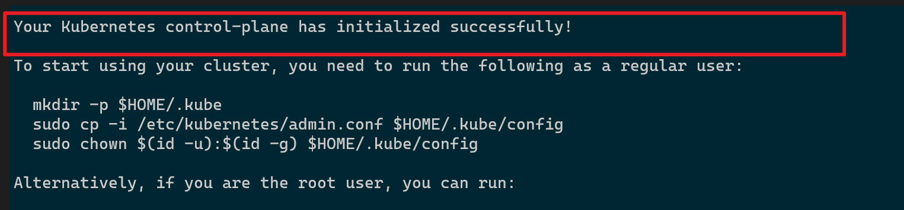
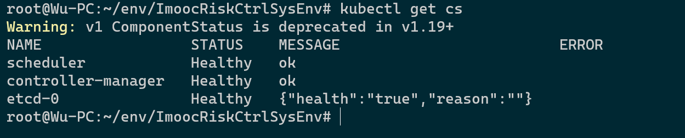
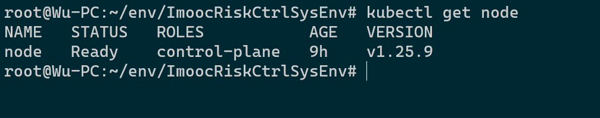

#### 前置工作
**`非常重要`**

1. 
* 修改host: 添加以下信息
**`非常非常非常重要`**
```
宿主机IP hbase
宿主机IP grafana
宿主机IP prometheus
宿主机IP flink
宿主机IP nginx
宿主机IP zookeeper
宿主机IP redis
宿主机IP clickhouse
宿主机IP kafka1
宿主机IP kafka2
宿主机IP kafka3
宿主机IP hadoop
宿主机IP yarn
宿主机IP mysql
宿主机IP nodejs
宿主机IP node
宿主机IP flume_exporter
宿主机IP kafka_exporter

```

3. 
* 配置docker ( 关于docker安装不作介绍, 注意docker版本 )
**`重要,否则k8s启动不了`**
```
sudo vi /etc/docker/daemon.json
```
```json
{
 "registry-mirrors": ["https://registry.docker-cn.com"],
 "exec-opts": ["native.cgroupdriver=systemd"]
}
```


4. 
* (k8s) kubelet, kadmin, kubectl 安装 ( 以ubuntu apk 安装为例 )
```
apt install -y curl

//注意末尾的横线
curl https://mirrors.aliyun.com/kubernetes/apt/doc/apt-key.gpg | apt-key add -

echo "deb https://mirrors.aliyun.com/kubernetes/apt/ kubernetes-xenial main" | sudo tee /etc/apt/sources.list.d/kubernetes.list

sudo apt-get update

sudo apt-get install -y kubelet=1.25.9-00 kubeadm=1.25.9-00 kubectl=1.25.9-00

//验证
kubeadm version
kubelet --version
kubectl version --output=yaml
containerd --version


```

5. 
* 配置hadoop. ( 在win环境下开发必须，Mac环境不需要 )
```
1. 添加环境变量 HADOOP_HOME，指向 driver/Hadoop 文件夹
2. 将%HADOOP_HOME%\bin加入到path里面
```


#### 镜像下载
* docker pull --platform linux/x86_64 grokzen/redis-cluster:6.2.1
* docker pull --platform linux/x86_64 flink:1.14.5-scala_2.11-java8
* docker pull --platform linux/x86_64 wurstmeister/kafka:2.13-2.8.1
* docker pull --platform linux/x86_64 iteblog/hbase-phoenix-docker:1.0
* docker pull --platform linux/x86_64 yandex/clickhouse-server:21.1.9.41
* docker pull --platform linux/x86_64 probablyfine/flume:2.0.0
* docker pull --platform linux/x86_64 wurstmeister/zookeeper:3.4.6
* docker pull --platform linux/x86_64 harisekhon/hadoop:2.7
* docker pull --platform linux/x86_64 mysql:5.7.25
* docker pull --platform linux/x86_64 node:20.5.1
* docker pull --platform linux/x86_64 debian:bullseye

<!-- * docker pull --platform linux/x86_64 bitnami/kafka:2.2.1-debian-9-r28 -->
<!-- * docker pull --platform linux/x86_64 bitnami/zookeeper:3.4.14-debian-9-r33 -->

**`==== k8s 镜像 ========`**
* docker pull --platform linux/x86_64 registry.aliyuncs.com/google_containers/kube-apiserver:v1.25.9
* docker pull --platform linux/x86_64 registry.aliyuncs.com/google_containers/kube-controller-manager:v1.25.9
* docker pull --platform linux/x86_64 registry.aliyuncs.com/google_containers/kube-scheduler:v1.25.9
* docker pull --platform linux/x86_64 registry.aliyuncs.com/google_containers/kube-proxy:v1.25.9
* docker pull --platform linux/x86_64 registry.aliyuncs.com/google_containers/pause:3.6
* docker pull --platform linux/x86_64 registry.aliyuncs.com/google_containers/etcd:3.5.6-0
* docker pull --platform linux/x86_64 registry.aliyuncs.com/google_containers/coredns:v1.9.3
<!-- * docker pull --platform linux/x86_64 kubernetesui/dashboard:v2.7.0
* docker pull --platform linux/x86_64 kubernetesui/metrics-scraper:v1.0.9
* docker pull --platform linux/x86_64 flannelcni/flannel:v0.21.0-amd64 -->
**`==== 普罗米修斯 镜像 ========`**
* docker pull --platform linux/x86_64 prom/prometheus:v2.38.0
* docker pull --platform linux/x86_64 grafana/grafana:9.0.9
* docker pull --platform linux/x86_64 zhijunwoo/flume_exporter:latest
* docker pull --platform linux/x86_64 danielqsj/kafka-exporter:v1.6.0
<!-- * docker pull --platform linux/x86_64 oliver006/redis_exporter:v1.44.0 -->

#### 项目环境搭建

`建议以root身份操作以下步骤`
( **`非常重要: 是将整个 env 文件夹导入到 OS, 我这里是导入到 ubuntu 的根目录`** )

步骤 1. 
```
//进入 env 文件夹

cd env

//解压 ImoocRiskCtrlSysEnv.tar.gz, 

tar xzvf ImoocRiskCtrlSysEnv.tar.gz

```

( **`非常重要: 项目的所有命令路径都是以 env/ImoocRiskCtrlSysEnv 作为相对路径`** )
步骤 2. 
```
//进入ImoocRiskCtrlSysEnv, 

cd ImoocRiskCtrlSysEnv

```

步骤 3.
```
sh imooc-env-setup.sh
```


#### k8s 集群搭建

步骤 1.  ( **`非常重要: 所有操作在 env/ImoocRiskCtrlSysEnv 文件夹内`** )
```
sh bin/sbin/k8s-init.sh

```

步骤 2.
```
//必须保证 containerd 是正常启动

systemctl start containerd
systemctl status containerd --no-pager --full


//稍微停留几分钟, 必须保证没有错误信息输出

journalctl -xfu containerd

//如果有报错, 后面的步骤也不会执行成功

```

步骤 3.
```
//看到 'Your Kubernetes control-plane has initialized successfully!' 即安装成功

kubeadm init --config=config/k8s/kubeadm.yaml

```

步骤 4.( **`非常重要: 安装成功后必须执行这3条命令`** )
```
mkdir -p $HOME/.kube
sudo cp -i /etc/kubernetes/admin.conf $HOME/.kube/config
sudo chown $(id -u):$(id -g) $HOME/.kube/config

```

步骤5
```
kubectl apply -f kube-flannel.yml 

```


步骤6
```
//验证组件状态 ( 正常的 STATUS 是 Healthy )

kubectl get cs

//验证节点状态 ( 正常的 STATUS 是 Ready )

kubectl get node

```
##### 附图-1. k8s 初始化成功


##### 附图-2. k8s 组件状态检查


##### 附图-3. k8s 节点检查


